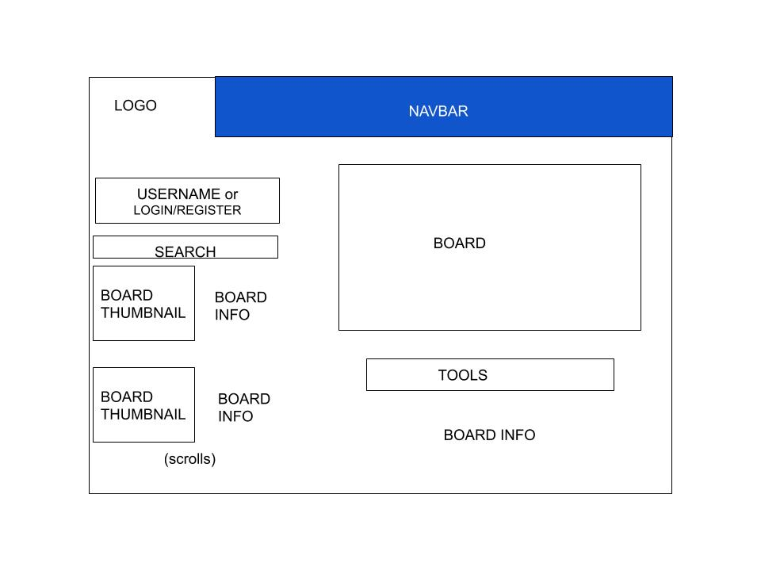
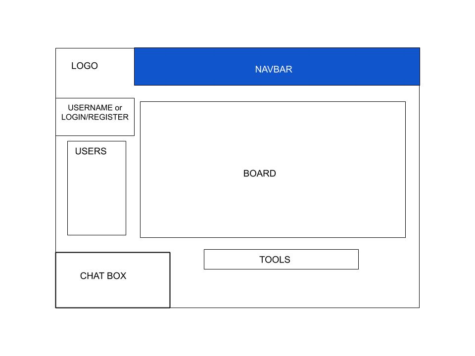
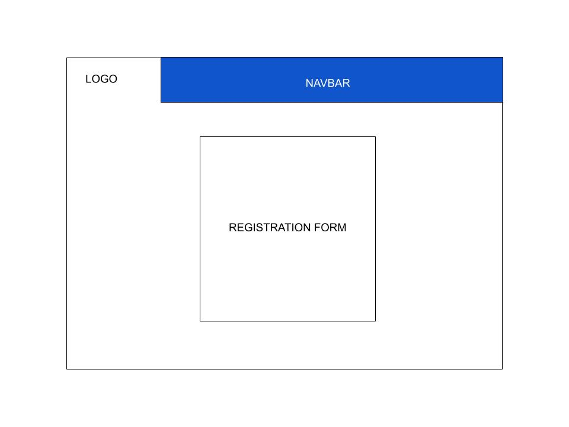

# Whiteboard

## Overview

Sometimes you wanna draw. Sometimes your friends wanna draw. And sometimes, you and your friends want to draw together! But other times you just need to share a board with some colleagues to keep track of important tasks.

Whiteboard is a web app that will allow users to draw on an online whiteboard together in real-time, with the option of drawing solo as well.  Users can register and log in. Unregistered users are able to use a whiteboard with others, but only registered users are able to save their boards with the option to view, edit, or delete them as they please.


## Data Model

The application will store Users and Boards

* users can have multiple boards (via references)
* boards can have multiple users (via references)

An Example User:

```JavaScript
{
  username: "drawguy123",
  hash: // password hash,
  boards: // array of references to Board documents
}
```

An Example Board:

```JavaScript
{
  users: // array of references to User documents,
  name: "Art",
  createdAt: // timestamp
}
```

## [Link to Commented First Draft Schema](src/db.js)


## Wireframes

/home - page for user managing boards



/draw - page for solo/collaborative whiteboard



/register - page for user registration/login



## [Site map](documentation/sitemap.jpg)

## User Stories or Use Cases

1. As a non-registered user, I can register a new account
2. As a non-registered user, I can start a new board
3. As a non-registered user, I can temporarily save my board
4. As a non-registered user, I can export my boards as images
5. As a user, I can log in to the site.
6. As a user, I can save and delete boards to and from my account.
7. As a user, I can see all my boards in a list

## Research Topics

* (5 points) Integrate user authentication
    * Passport.js for user authentication
    * (Test account to be added)

* (4 points) Perform client side form validation using a JavaScript library
    * Will be a search bar based on titles

* (3 points) Integrate drawing tool
    * Paper.js for canvas

* (5 points) Integrate real-time communication
    * Socket.io for real-time communication
    * Chatroom, live canvas

* (5 points) Next.js
    * React.js/Next.js for frontend
    * Change list display of user's drawings based off create/delete
    * Interactive notes for each drawing

## [Link to Initial Main Project File](src/app.js)

## Annotations / References Used

TBD
